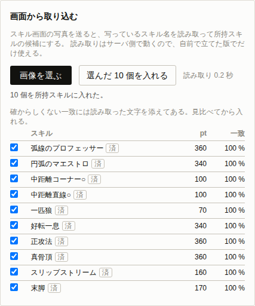

# M10 の結果

[スキル画面の読み取り](ocr-design.md)を実装した。
画面を写した画像を送ると、写っているスキル名を読み取って所持スキルの候補にする。



## 1. 学習データを選んだ

三通りある日本語の学習データを、同じ見本の画像で比べた。
見本はスキル名を 10 個縦に並べて組み立てたものである。

| 種類 | 大きさ | 時間 | 結果 |
| --- | ---: | ---: | --- |
| `tessdata_fast` | 2.4 MB | 194 ms | `一匹狼` を `ー忠狼` と読み違えた |
| `tessdata`（標準） | 35.7 MB | 197 ms | 10 件すべて正しい |
| `tessdata_best` | 13.7 MB | — | 動かない |

**標準のものを選んだ。**
15 倍の大きさで速度は変わらないので、サーバ側に置くなら選ばない理由が無い。

`tessdata_best` は浮動小数の LSTM を使い、SIMD を有効にした版の tesseract を要求する。
tesseract.js が読み込む既定の中身では `DotProductSSE` が見つからずに落ちる。

35 MB をリポジトリに置くわけにはいかないので、イメージを組むときに取ってくる形にした（`scripts/fetch-tessdata.mjs`）。
検査でも同じ口から取るので、CI では実際に読み取りが走る。
手元で学習データが無ければ、読み取りを使う検査だけが飛ぶ。

## 2. 読み取った文字をスキルに戻す

読み取った文字はそのままでは名前と一致しない。
崩れ方は二通りあり、それぞれ別の手当てをした。

**書き分けの揺れ**は正規化で消える。
丸印は `○` にも `〇` にもなる。
標準のモデルは 1 文字ずつ空白を空けて返す（`弧 線 の プ ロ フ ェ ッ サ ー`）。

**文字の取り違え**は正規化では消えないので、編集距離で近いものを拾う。

### 一 と ー を同一視してよいか

`一匹狼` が `ー忠狼` になった例のように、長音と漢数字の一は入れ替わる。
この二つを同じ文字として扱えば距離が 1 縮むが、別のスキルと区別が付かなくなる恐れがある。

全 2106 件の名前で確かめた。
**この二つを同一視しても、区別が付かなくなる組は一つも無い。**
確かめてから寄せている。

### 短い名前

3 文字の名前は 1 文字違うだけで一致の度合いが 0.67 まで落ちる。
一方で、別の 3 文字の名前とも同じくらい近くなる。
そこで短い名前には厳しい下限（0.75）を置いた。

`ー忠狼` は正規化しても `一匹狼` と 1 文字違いで残り、この下限で落ちる。
読み違えたものを黙って別のスキルとして取り込むより、拾わないほうが害が小さい。

### 完全一致は紛らわしくない

一致には 2 番目の候補との差を添え、差が小さいものには画面で「要確認」の印を付ける。

最初はこれだけで判断していたが、`中距離コーナー○` が要確認になった。
`中距離コーナー◎` と 1 文字しか違わないためである。
読み取った文字が前者と完全に一致しているのだから、迷う余地は無い。
**正規化して完全に一致したものは、隣に似た名前があっても確からしいものとして扱う。**

## 3. 口の形

```
POST /api/ocr/skills
content-type: image/png
（本文は画像そのもの。上限 8 MB）
```

tesseract は Worker として 1 本だけ立て、依頼を並べて順に流す。
立ち上げに数百ミリ秒かかるので使い回し、読み取り自体は直列にする。
中では 1 スレッドしか使わないため、並べても速くならない。

学習データの置き場が指定されていなければ、口ごと閉じて 501 を返す。
[配信](deploy.md)している GitHub Pages の版には `/api` が無いので、画面には口が無いことを伝える文言を出す。
黙って失敗させない。

## 4. 確かめたこと

- 正規化が丸印と空白と長音の揺れを消す。
- 編集距離が期待どおりに出る。
- 実際に読み取れた崩れ方（`中 距 離 コ ー ナ ー 〇` など）からスキルが引ける。
- 関係のない文字列（`スキル`、`所持スキル一覧を表示する`、`12345`）を拾わない。
- 短い名前には厳しい下限が効き、`ー忠狼` を拾わない。
- 全文から拾い、同じスキルを二度返さない。
- 見本の画像から 10 件すべてを引き当て、余計なものを拾わない。
- 依頼を並べても取り違えない。
- 学習データが無ければ 501、画像でなければ 415、大きすぎれば 413 を返す。
- ブラウザから画像を選ぶと候補が並び、選んだものが所持スキルに入る（`pnpm e2e:import`）。

`packages/data/test/skill-match.test.ts` に 10 件、`apps/api/test/ocr.test.ts` に 6 件置いた。
全体では 112 件になっている。

## 5. これは本物の画面で試していない

**検査に使っている画像は、スキル名を縦に並べて組み立てたものである。**
実際のゲーム画面ではない。

ここで測れるのは、口が繋がっていることと、読み取った文字をスキルに戻せることまでである。
実際の画面には背景の模様、枠、アイコン、重なった文字がある。
そこでどれだけ読めるかは、この見本では測れない。

本物の画面が手に入ったら、次を確かめる必要がある。

- 背景の模様が文字に被ったときに読めるか。二値化や切り出しの前処理が要るか。
- 一覧が縦に長い場合、何回かに分けて送る形でよいか。
- スキル名以外の文字（ポイント数、説明文、見出し）を拾ってしまわないか。
- 画面のどの領域を切り出すべきか。決め打ちできるなら、そのほうが精度も速度も上がる。

読み取る対象が自分のスキル一覧なのか、相手のウマ娘の詳細画面なのかも決めていない。
いまの実装は画像のどこにスキル名があってもよい形なので、どちらでも動く見込みはある。
ただし相手の詳細画面から取り込む先（[勝率](m9-report.md)の面の相手の欄）には繋いでいない。
