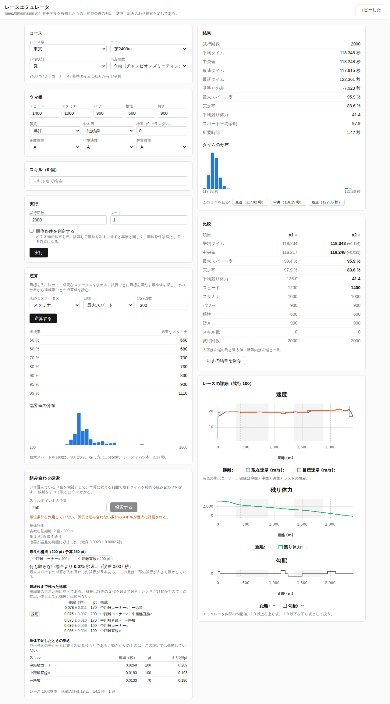

# M3 の結果

[改良版の設計](webapp-design.md)の M3、UI の骨格ができた。
設定を入れて実行し、統計と 1 本のレースの中身を見るところまでがブラウザ上で動く。



## 1. 構成

```
apps/web/
  index.html
  vite.config.ts
  src/main.tsx, App.tsx
  src/store.ts              Zustand の 1 ストア。設定、実行、結果を持つ
  src/components/Inputs.tsx コース、ウマ娘、スキル、実行のパネル
  src/components/Summary.tsx 統計の表とタイムの分布
  src/components/Charts.tsx  フレーム単位の 3 つの図
  e2e/smoke.mjs             Playwright で実際に動かす確認
```

計算は `packages/sim` をそのまま使う。
UI 側に計算式は 1 つも書いていない。

## 2. ブラウザでの並列実行

[M2 の結果](m2-report.md)で残していた「ブラウザでの実測」を済ませた。
4 コアの環境（`navigator.hardwareConcurrency` が 4、既定の並列数はその 1 つ手前の 3）で計測した。

| コース | 試行回数 | 所要時間 |
| --- | ---: | ---: |
| 東京 芝2400m | 2000 | 1.7 秒 |
| 東京 芝2400m | 10000 | 5.90 秒 |

Node で同じ 3 並列を測ったときは 7.05 秒だったので、ブラウザのほうがむしろ速い。
Node 側の計測は tsx を通しているぶんの上乗せがある。

設計の 5 節に置いた「2000 m 級のコースで 1 万試行を数秒」という目標は、これで満たせた。
Web Worker のアダプタが実際に動くことも、これで確かめられた。

## 3. 図の作り方

3 つの図を縦に並べ、x 軸（距離）を共有し、カーソルを同期させた。

- **速度**：現在速度と目標速度の 2 系列。
- **残り体力**：1 系列。
- **勾配**：1 系列。

**2 つの y 軸を 1 つの図に重ねることはしない。**
速度と体力は単位も桁も違うので、同じ図に置くと片方の変化が読めなくなる。
縦に並べて x 軸を揃えれば、同じ地点で何が起きたかは読める。

背景にはコーナーを薄い帯で、フェーズの境界を破線で描いた。
スキルの発動位置がコーナーや坂とどう噛み合っているかを、数字を突き合わせずに読めるようにするためである。

色は、系列に使うものと文脈に使うものを分けた。
速度と目標速度と体力にはカテゴリ用の色を順に割り当て、勾配は系列ではなくコースの性質なので地の文字色で描いている。
使った 3 色は色覚特性を含めた分離の検査を通してある（明色面での体力の色だけが背景との対比 3:1 を下回るため、その図は単系列にして見出しで名前を示している）。

タイムの分布はヒストグラムにした。
本家は平均と最速と最遅の 3 値だけだったので、設定を変えたときに分布のどこが動いたのかが見えるようになった。
分布の最速と中央と最遅にはボタンを付け、**その 1 本のレースの中身をそのまま開ける**ようにした。
[M1 の結果](m1-report.md)で入れたシード付き乱数の使い道がここに出る。

## 4. 確認の仕方

`pnpm e2e` で、ビルドした成果物を実際のブラウザで動かす。
スキルを 2 つ選んで実行し、統計が出ること、図が 3 つ描かれること、コンソールにエラーが出ないことを確かめ、画面を撮る。
上の画像はその出力である。

## 5. 積み残し

- **バンドルが重い**：スキルデータ 1.7 MB をそのまま埋め込んでいるため、本体が 2.05 MB（gzip 299 kB）、Worker 側が 1.79 MB になっている。取得に切り替えれば初回表示が軽くなる。
- **入力が一部足りない**：デバフの個数、ポジションキープの方式、スキル発動率の固定、ランダム区間の引きは、まだ画面から変えられない。
- **スキルごとの集計が無い**：発動率や平均発動位置は計算できるが、並列実行ではフレームを記録していないので集計していない。どう取るかは M4 で決める。
- **モバイル対応と比較と共有**：M4 の範囲。

## 6. 次にやること

M4 に進む。
設定のスナップショットを並べる比較、URL への設定の載せ方、モバイルでの 1 カラム表示、そしてスキルごとの集計を実装する。
