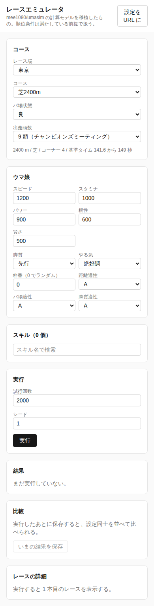

# M4 の結果

[改良版の設計](webapp-design.md)の M4、比較と共有ができた。
あわせて、M3 で積み残していたスキルごとの集計も入れた。

| 画面 | |
| --- | --- |
|  |  |

## 1. スキルごとの集計

M3 の時点では、並列実行がフレーム列を捨てているため、スキルごとの発動率を出せなかった。
フレーム列を残せば集計はできるが、1 レースあたり千数百個のオブジェクトを作ることになり、速度の設計が崩れる。

そこで、**発動した瞬間だけを記録する**ことにした。

```ts
interface SkillTraceEntry {
  count: number;          // 発動回数
  firstPosition: number;  // 初回の位置
  secondPosition: number; // 2 回目の位置
  firstPhase: number;     // 初回のフェーズ
}
```

スキルの発動はレース全体で数回しかないので、記録の費用は無視できる。
Worker はこの記録を試行ごとに畳み込み、スキルあたり 8 個の数値にして返す。
プールは塊ごとの数値を足し合わせるだけで済む。

出力は発動率、平均発動位置、2 回発動率、初回発動のフェーズである。

配線が正しいことは数字で確かめられる。
賢さ 900 のとき、スキルの発動抽選は `100 - 9000 / 900 = 90` パーセントである。
条件がほぼ常に満たされる 2 つのスキルで測ると、発動率は 89.5 パーセントと 89.8 パーセントになった。
抽選の上限にきちんと張り付いている。

集計が分割の仕方に依らないことも確かめた。
発動回数は整数なので塊の切り方によらず完全に一致する。
位置の合計だけは、足す順序が変わるぶん最下位の桁がずれる（10 進で 14 桁目）。
テストはこの二つを分けて主張している。

## 2. 比較

実行した結果を保存すると、列として横に並ぶ。

- 左端の列と違う値は太字にし、タイムには差を括弧で添える。
- 列見出しを押すと、その設定を入力欄に戻せる。
- 統計だけでなくステータスとスキル数も同じ表に並べる。設定のどこが違うから結果が違うのかを、1 つの表で追えるようにするためである。

本家は履歴を切り替えて見る形だったので、横に並べて差を出すのが変えた点になる。

## 3. URL への設定の載せ方

依存を増やさずに済ませたいので、位置で並べた文字列を base64url にする。

```
1|10006,10606,1,9|1400,1000,900,600,900,0,1,1,1,1,1,0,6|100751,200761|2000,1
```

先頭はこの形式の版数である。
鍵の名前を持たないぶん JSON より短く、スキル ID の並びが長さの大半を占める。
ボタンを押すと URL がアドレス欄に反映され、クリップボードにも入る。
開き直すと設定が戻る。

## 4. 小さい画面

幅 390 ピクセルで 1 カラムに畳まれることを確かめた。
ステータスの入力は 2 列、表は横スクロールに落ちる。
横方向のあふれは 0 ピクセルである。

## 5. 確認の仕方

`pnpm e2e` が M3 から広がった。
いまは次を順に確かめ、どれかが崩れたら終了コードを 1 にする。

1. スキルを 2 つ選んで実行し、統計の試行回数が入力と一致する。
2. スキルごとの発動の表が、選んだスキルのぶんだけ行を持つ。
3. 図が 3 つ描かれる。
4. 設定を変えてもう一度実行し、比較の表が 2 列になる。
5. 共有 URL を作り、別のタブで開いて設定が戻る。
6. 幅 390 ピクセルで横にあふれない。
7. コンソールにエラーが出ない。

## 6. 積み残し

- **バンドルが重い**：スキルデータを埋め込んだままなので、本体 2.06 MB（gzip 300 kB）と Worker 側 1.79 MB は M3 から変わっていない。
- **入力が一部足りない**：デバフの個数、ポジションキープの方式、スキル発動率の固定、ランダム区間の引きは、まだ画面から変えられない。逆算と探索では発動率の固定を使うので、M5 で入れる。
- **比較の保存が一時的**：画面を閉じると消える。`localStorage` に置くかは M5 で決める。

## 7. 次にやること

M5 の逆算に進む。
[逆算と組み合わせ探索の設計](solver-design.md)の 2 節にあるとおり、まず 1 試行の中でスタミナを動かしたときに達成が単調に変わるかを検査し、その結果で臨界値の求め方を決める。
