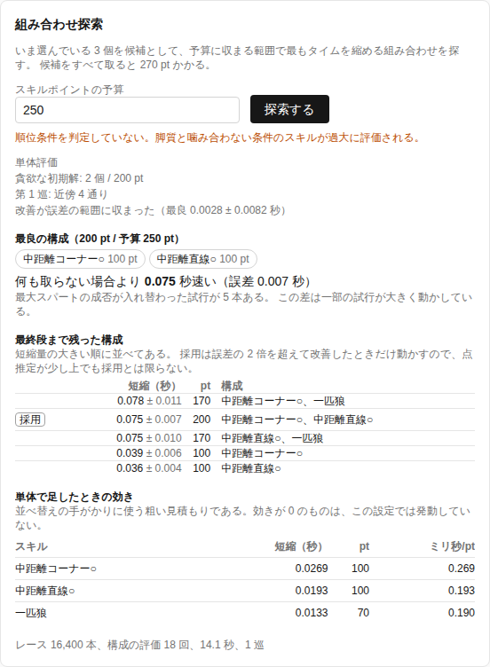

# M7 の結果

[逆算と組み合わせ探索の設計](solver-design.md)の 3 節で決めた組み合わせ探索を実装した。
候補のスキルとスキルポイントの予算を与えると、予算に収まる範囲で最もタイムを縮める組み合わせを返す。



## 1. 共通乱数がどこまで効くか

設計の土台は、候補どうしを同じ試行番号どうしで引き算することにある。
実装してから、それが本当に効いているかを測った。

まず、効くはずのないスキルで確かめる。
負けん気は発動条件にマイル限定が入っているので、東京芝2400 では発動しようがない。
これを構成に足したとき、4000 試行すべてでタイムの差が**厳密に 0** になった。

**乱数をストリームに分けた狙いは、この 1 行で確かめられる。**
スキルを 1 つ足しても他の出目は動かない。
足したスキルが効かなければ、レースは 1 フレームも変わらない。

効くスキルではこうなる（東京芝2400、先行、4000 試行、弧線のプロフェッサーを 1 つ足した差）。

| 測り方 | 差の標準誤差 |
| --- | ---: |
| ペアで取った差 | 0.00168 秒 |
| 別々に平均した場合 | 0.00444 秒 |

標準誤差で 2.63 倍、必要な試行数にすると 6.9 倍の差になる。
同じ精度を出すのに走らせるレースが 7 分の 1 で済む。

## 2. 残った分散はどこから来るか

2.63 倍は、期待したほど大きくない。
差がほとんど消えるなら、もっと縮んでいいはずである。
そこで差の分布を見た（4000 試行）。

| スキル | 差の平均 | 差の標準偏差 | 差が 0 の割合 | 最大スパートが入れ替わった試行 |
| --- | ---: | ---: | ---: | ---: |
| 弧線のプロフェッサー | 0.0825 | 0.1065 | 13.0 % | 3 本 |
| 円弧のマエストロ | 0.1135 | 0.1445 | 10.0 % | 9 本 |
| 中距離コーナー○ | 0.0436 | 0.0615 | 12.7 % | 2 本 |
| 負けん気 | 0.0000 | 0.0000 | 100.0 % | 0 本 |

最大スパートの成否が変わらなかった試行だけを取ると、標準偏差は 0.0441 まで落ちる。
入れ替わった 3 本の差は平均 -3.4574 秒である。

**4000 本のうち 3 本が、差の分散の 8 割を作っている。**
スキルで速く走ったぶん体力を早く使い、最大スパートに届かなくなる試行がまれに出る。
そこだけタイムが 3 秒以上動く。

これは実装の不備ではなく、モデルがそう振る舞っているということである。
ただし扱いには注意が要る。
平均が一握りの試行に乗っているとき、標準誤差そのものが試行の引き方で揺れる。
実際、同じ比較を 2000 試行で測ったときと 4000 試行で測ったときで、差の標準偏差は 0.144 と 0.106 に分かれた。

そこで探索の結果には、**最大スパートの成否が入れ替わった試行数**を併記することにした。
これが多い比較は、平均だけを見ても足りない。

## 3. 費用の構造

スキルの表示ポイントは、そのスキルを持つまでに要する総額である。
右回りの鬼は 330 で、下位の右回り○ 90 と右回り◎ 200 を含んでいる。

したがって同じグループから 2 つ取ることはない。
上位に乗り換える費用は差額になる。
実装では、構成の総額を求めるときにグループごとに最も高いものだけを数える（`packages/solver/src/cost.ts`）。
スキルデータには 758 のグループがある。

## 4. 何が選ばれるか

東京芝2400、9 頭立て、順位条件を判定する設定で、候補 20 個から選ばせた。

先行、予算 600 pt のとき、選ばれたのは次の 5 個である。

| スキル | pt |
| --- | ---: |
| 一匹狼 | 70 |
| 中距離コーナー○ | 100 |
| 中距離直線○ | 100 |
| 末脚 | 170 |
| スリップストリーム | 160 |

短縮は 0.1873 秒（誤差 0.0076 秒）である。

**単体で最も効くスキルは 1 つも入っていない。**
単体の効きは円弧のマエストロが 0.1121 秒で最大だが、340 pt かかる。
一匹狼は 0.0500 秒だが 70 pt なので、ポイントあたりでは 3 倍近く効く。
予算が 600 pt のうちは、安いものを並べたほうが速くなる。

## 5. 順位条件を判定するかどうかで答えが変わる

[M6 の結果](m6-report.md)で、脚質と噛み合わない順位条件のスキルが過大に評価されることを示した。
探索を回すと、それが選ぶスキルの違いとして出てくる。

追込、予算 1200 pt、同じ候補 20 個で比べた。

| 単体の効き | 順位を無視 | 順位条件を判定 |
| --- | ---: | ---: |
| 順風満帆（前半分） | 0.1014 秒 | **0.0000 秒** |
| 正攻法（前半分） | 0.0919 秒 | **0.0040 秒** |
| 真骨頂（後方寄り） | 0.0925 秒 | 0.0925 秒 |

選ばれる構成もこう変わる。

| | 選ばれた 360 pt のスキル | 短縮 |
| --- | --- | ---: |
| 順位を無視 | 順風満帆 | 0.3486 秒 |
| 順位条件を判定 | 真骨頂 | 0.3443 秒 |

**順位を無視したまま探索すると、追込に発動しようのない 360 pt のスキルを勧めてしまう。**
残りの 6 個は両方で同じものが選ばれるので、違いはこの 1 枠に集中する。

真骨頂の評価が両方で 0.0925 秒のまま動かないのは、追込なら後方寄りの条件がどのみち満たされるからである。
順位条件の判定は、順位条件つきのスキルを一律に下げるのではなく、脚質と噛み合わないものだけを下げる。

## 6. 探し方と計算量

手順は[逆算と組み合わせ探索の設計](solver-design.md)の 3.4 節のとおりである。
単体の効率で並べて貪欲に初期解を作り、そこから足す、外す、入れ替えるの近傍を探す。
近傍は 200 試行でふるいにかけ、残ったものを 600 試行、2000 試行と増やして比べる。

先行、予算 600 pt の実測は次のようになった。

```
貪欲な初期解: 5 個 / 550 pt
第 1 巡: 近傍 25 通り → 採用（基準から 0.1873 秒短縮）
第 2 巡: 近傍 18 通り → 改善が誤差の範囲に収まった（最良 -0.0059 ± 0.0040 秒）
レース 34,200 本、構成の評価 77 回、68.1 秒、2 巡
```

候補 20 個から予算に収まる組み合わせを総当たりすると数万通りになる。
それを 77 回の評価に落とせている。
打ち切りは、最良の近傍の改善が標準誤差の 2 倍を超えないときに掛かる。

**この打ち切りのため、返す構成が一覧の最上位とは限らない。**
点推定でわずかに上でも、誤差の範囲なら動かさない。
画面ではどれを採用したかを印で示し、その旨を添えている。

## 7. 確認したこと

`packages/sim/test/optimize.test.ts` に置いた。

- 効かないスキルを足した差は、全試行で厳密に 0 になる。
- 効くスキルではタイムが縮み、ペアで取った差の標準誤差はタイムそのものから作るより小さい。
- 同じ入力なら同じ答えを返す。
- 返す構成も一覧に載る構成も、予算を超えない。
- 同じグループから 2 つ取っても、総額は上位のぶんだけになる。
- 追込に順風満帆を持たせたとき、順位条件を判定すると評価が 4 分の 1 未満に落ちる。
- ブラウザでも探索が通り、予算に収まる構成が返る（`pnpm e2e` に組み込んだ）。

## 8. 残していること

- **候補の自動的な絞り込み**：いまは画面で選んだスキルがそのまま候補になる。1000 個から選ばせることはできない。
- **ヒントレベル**：`cost.ts` は割引を計算できるが、画面から入力する口がない。
- **金スキルの前提条件**：上位スキルを取るのに下位が要ることは費用に織り込んであるが、取得順の制約までは見ていない。
- **順位以外の条件**：距離差と内外の位置は[M6 の結果](m6-report.md)の 5 節のまま未実装である。それらの条件を持つスキルは、探索でも過大に評価される。

探索はモデルの上で最良のものを返す。
[逆算と組み合わせ探索の設計](solver-design.md)の 4 節に書いたとおり、モデルが過大に評価している所があれば、探索はそこを突く。
未実装の条件が残っているうちは、その条件を持つスキルの結果を鵜呑みにしないほうがよい。
