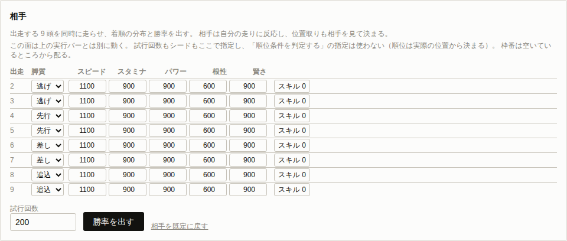

# M9 の結果

[全頭を同時に走らせる設計](multi-horse-design.md)を実装した。
出走する全頭が同じフレームを一緒に進み、互いの位置を見ながら走る。
着順の分布と勝率が出せるようになった。



## 1. 作り直しにはならなかった

設計の前に読み直したところ、必要な仕組みは三つとも揃っていた。

`updateFrame` は 1 頭を 1 フレーム進める関数であり、`progressRace` はそれをゴールまで呼ぶだけである。
位置取りを `VIRTUAL` にしたときの仮想の先頭馬は `RaceState` として作られ、毎フレーム一緒に進み、位置取りの判定はその位置を毎フレーム読んでいる。
レーンも `currentLane` として 1 頭ごとに持っている。

**生きた相手に反応する仕組みは、相手が 1 頭のときについてすでに動いていた。**
足りなかったのは、それを N 頭に広げることと、順位を束からではなくその場の位置から求めることだけである。

順位と距離差の問い合わせは 5 つのメソッドに閉じていたので、`FieldView` を interface にし、束を読む `RecordedField` と生きた位置を読む `LiveField` の二つを置いた。
条件の判定側は 1 行も変えていない。

## 2. 同時に進めるための二段階

1 フレームを二段階に分ける。

```
フレーム t:
  第 1 段: 全頭について startPosition = position を置く
  第 2 段: 全頭について updateFrame を呼ぶ
```

先に全頭の位置を揃えるのは、**頭数の並び順が結果に効かないようにする**ためである。
一段階で順に進めると、先に進めた頭は前フレームの位置を見て、後の頭は今フレームの位置を見ることになる。

`updateFrame` は冒頭で同じ代入をするので、第 2 段でその頭を進める時点では置き直しになるだけである。
フレームの中身には手を入れていない。

この性質は検査で押さえてある。
種と枠を固定したうえで出走順を逆に並べ替え、各頭のタイムが小数第 9 位まで一致することを確かめている。

## 3. 脚質が順位を決めてしまう問題は解けた

[M6](m6-report.md)の 4 節で、フィールド軌跡モデルでは順位が脚質でほぼ決まってしまうことを数字で示した。
同じ問いに全頭同時で答える。

東京芝2400、9 頭、全頭とも 1200-1000-900-600-900、500 試行。

| 出走 | 脚質 | 1 着 | 2 着 | 3 着 | 4 着 | 5 着以下 | 平均着順 | 平均タイム |
| --- | --- | ---: | ---: | ---: | ---: | ---: | ---: | ---: |
| 0 | 逃げ | 3.4 % | 8.0 % | 10.6 % | 11.2 % | 66.8 % | 5.75 | 117.880 |
| 1 | 逃げ | 5.8 % | 7.0 % | 11.4 % | 8.6 % | 67.2 % | 5.66 | 117.871 |
| 2 | 先行 | 7.2 % | 10.8 % | 9.4 % | 13.0 % | 59.6 % | 5.25 | 117.758 |
| 3 | 先行 | 7.8 % | 11.0 % | 11.6 % | 11.8 % | 57.8 % | 5.27 | 117.743 |
| 4 | 先行 | 9.6 % | 11.8 % | 10.4 % | 10.2 % | 58.0 % | 5.10 | 117.724 |
| 5 | 差し | 14.0 % | 11.4 % | 9.4 % | 9.0 % | 56.2 % | 4.94 | 117.703 |
| 6 | 差し | 14.0 % | 11.2 % | 13.2 % | 11.8 % | 49.8 % | 4.69 | 117.667 |
| 7 | 追込 | 20.0 % | 18.0 % | 9.8 % | 12.6 % | 39.6 % | 4.02 | 117.620 |
| 8 | 追込 | 18.2 % | 10.8 % | 14.2 % | 11.8 % | 45.0 % | 4.32 | 117.640 |

[M6](m6-report.md)では差しが 1 パーセント、追込が 0 パーセントしか 1 着を取れなかった。
**どの脚質も 1 着を取るようになり、平均着順は 4.0 から 5.8 の幅に収まっている。**

同じステータスなら着順は均されるはずだと考えるなら、この表はまだ平らではない。
9 頭の平均着順が 5 なのに対し、逃げは 5.7、追込は 4.0 である。
順位が脚質で決まっていた状態からは離れたが、脚質による差は残っている。

### この差をどう読むか

このモデルでは前を走るほうが体力を使う。
逃げは 2 頭が先頭を争ってペースを上げ下げし、追込は後ろで待って最後に伸びる。
2400 m でスタミナ 1000 は余裕のある設定ではないので、前で使ったぶんが終盤に効く。

距離を変えると傾向も変わる。
同じ並びで 1 頭あたりの勝率を測ると、次のようになった（300 試行、`pnpm multi --location ... --course ...`）。

| コース | 逃げ | 先行 | 差し | 追込 |
| --- | ---: | ---: | ---: | ---: |
| 中山 芝1200m(外) | 4.2 % | 9.1 % | 17.7 % | 14.5 % |
| 東京 芝1800m | 8.7 % | 13.1 % | 9.4 % | 12.3 % |
| 東京 芝2400m | 4.7 % | 8.3 % | 13.8 % | 19.0 % |

脚質の優劣が距離で入れ替わるので、単に後ろが強いモデルになっているわけではない。
ただし逃げはどの距離でも下にいる。
これがゲームの挙動と合っているかは、ゲーム内の実測と突き合わせないと分からない。
逃げを 1 頭だけにしたときにどうなるかも測っていない。
7 節の確かめることに残す。

## 4. 相手の強さが勝率に効く

自分を先行 1200-1000 に固定し、相手 8 頭のスピードだけを動かした（500 試行）。

| 相手のスピード | 勝率 | 連対率 | 複勝率 | 平均着順 |
| --- | ---: | ---: | ---: | ---: |
| 900 | 71.4 % | 84.8 % | 92.2 % | 1.64 |
| 1000 | 46.8 % | 67.0 % | 77.0 % | 2.43 |
| 1100 | 25.0 % | 44.2 % | 58.6 % | 3.49 |
| 1200 | 10.0 % | 22.4 % | 35.6 % | 4.64 |
| 1300 | 6.4 % | 15.8 % | 26.6 % | 5.09 |
| 1400 | 3.6 % | 9.2 % | 19.4 % | 5.46 |

単調に下がる。
相手と同じ 1200 のところで勝率が 10.0 パーセントになり、9 頭で等しく分ければ 11.1 パーセントであることとほぼ合う。

## 5. 位置取りが脚質ごとに違う形で出る

相互作用が実際に働いていることを、位置取りの状態から見る。
全頭同じステータスで 100 レース走らせ、レース途中の順位と、位置取りの状態に入った回数を数えた（`pnpm multi`）。

| 出走 | 脚質 | レース途中の平均順位 | 入った位置取り |
| --- | --- | ---: | --- |
| 0 | 逃げ | 1.86 | 追い抜き 197、加速 160、緊急ペースアップ 78 |
| 1 | 逃げ | 1.98 | 追い抜き 212、加速 137、緊急ペースアップ 78 |
| 2 | 先行 | 4.04 | ペースアップ 233、ペースダウン 92、緊急ペースアップ 44 |
| 3 | 先行 | 4.00 | ペースアップ 248、ペースダウン 94、緊急ペースアップ 44 |
| 4 | 先行 | 4.10 | ペースアップ 235、ペースダウン 95、緊急ペースアップ 44 |
| 5 | 差し | 6.83 | ペースアップ 279、ペースダウン 109、緊急ペースアップ 18 |
| 6 | 差し | 6.84 | ペースアップ 276、ペースダウン 108、緊急ペースアップ 18 |
| 7 | 追込 | 7.62 | ペースアップ 270、ペースダウン 160 |
| 8 | 追込 | 7.72 | ペースアップ 267、ペースダウン 156 |

逃げは先頭を争い、後ろの脚質は離されればペースを上げ、詰まれば下げる。
2 頭の逃げが 100 レースで 200 回前後も追い抜きに入っているのは、互いを相手にしているからである。
フィールド軌跡モデルでは相手が自分に反応しないので、この形は出せなかった。

## 6. 計算量と、既存の方式との使い分け

1 試行あたり 32 ms である。
1 頭だけ走らせると 2.1 ms なので 15 倍にあたる。
9 倍で済まないのは、毎フレーム他頭の位置を引く手間が乗るためである。

ブラウザでは Worker に投げるので、9 頭 200 試行が 2.1 秒で返る。

共通乱数の効きも測った。
相手を固定したまま自分にスキルを 1 つ足したときの差である（500 試行）。

| | 値 |
| --- | ---: |
| 短縮 | 0.1096 秒 |
| ペアで取った差の標準誤差 | 0.01440 秒 |
| 別々に平均した場合の標準誤差 | 0.02175 秒 |
| 標準誤差の縮み | 1.51 倍 |
| 差が厳密に 0 だった試行 | 13.0 % |

[M7](m7-report.md)の 1 節では単独走で 2.63 倍だったので、効きは落ちている。
自分が速くなれば相手の走りも物理的に変わるためであり、[設計](multi-horse-design.md)の 3.4 節で予想したとおりである。

一方で、**差が厳密に 0 になる試行は 13.0 パーセント残った**。
足したスキルが発動しなければ 9 頭ぶんのレースが 1 フレームも変わらない。
相互作用を入れても、出目が同じなら結果が同じであることは保たれている。

以上から、方式は目的で使い分ける。

- **勝率と着順**：全頭同時。相手の構成を入力に含める。
- **スキルの組み合わせ探索**：フィールド軌跡モデルのまま。1 回の探索で数万レースを走らせるので、1 試行 32 ms では実用にならない。

探索が返した構成を全頭同時で確かめる、という順で使う。

## 7. 確かめたこと

`packages/sim/test/multi.test.ts` に 8 件置いた。

- 着順が 1 から頭数まで重複なく付き、タイムの順に並ぶ。
- 枠番が重ならない。
- 同じ入力なら同じ結果になる。
- 出走順を入れ替えても各頭の走りが変わらない。
- 逃げが前を走り、追込が後ろを走る。
- 相手を強くすると勝率が下がる。
- Worker で回しても単一スレッドと一致する。
- 単独で走らせたときとは違う結果になる。

既存の 88 件も通っている。
本家との突き合わせが通っているので、1 頭だけ走らせる経路の挙動はこの作業で変わっていない。

ブラウザでも 9 頭 200 試行が通り、勝率の合計が 100 パーセントになること、平均着順の平均が 5 になること、複勝率と連対率と勝率の大小が揃うことを `pnpm e2e` で見ている。

## 8. まだ確かめていないこと

- **脚質ごとの勝率がゲームと合うか。** 3 節の傾向はこのモデルの上での話であり、ゲーム内の実測とは突き合わせていない。
- **逃げが 1 頭だけのとき。** 3 節は逃げ 2 頭で測っている。先頭争いが無いときにどうなるかは測っていない。
- **ブロック。** 自分が他頭を塞ぐことも、塞がれることもない。前方ブロックと横ブロックは確率のままである。
- **レーンを使う条件。** 全頭が `RaceState` になったのでレーンは揃ったが、`is_behind_in` や `lane_type` がレーンのどの値をどう比べるものなのかを確かめていない。当てずっぽうで実装するより、[M8](m8-report.md)の 8 節のまま無視しておくほうが害が小さい。
- **相手のプリセット。** いまは相手を 1 頭ずつ入力する。チャンピオンズミーティングの想定を丸ごと当てる口はまだ無い。
