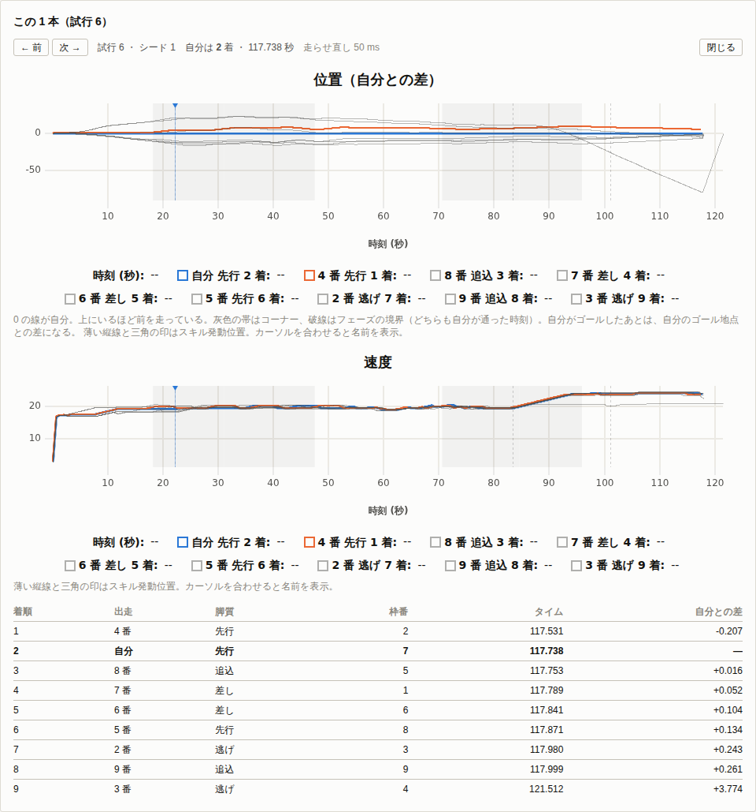

# 全頭を同時に走らせる設計

出走する全頭を相互作用ありで同時に走らせ、着順の分布と勝率を出す。
[順位条件の扱い](order-condition.md)の 4 節で L4 と呼んだ水準にあたる。

## 1. いまどうなっているか

[M6](m6-report.md)で入れたフィールド軌跡モデルでは、相手 N-1 頭の位置の時系列をあらかじめ作っておき、実行時は位置を比較して順位を出す。
相手は自分の影響を受けず、相手どうしも干渉しない。
この割り切りのおかげで、フィールドは自分の構成に依存せず、全試行と全探索候補で使い回せる。

割り切りの代償は二つある。
**相手が自分に反応しない**ので、自分が抜いても相手はペースを上げない。
**相手が全員同じ想定**なので、脚質しか違わず、[M6](m6-report.md)の 4 節で測ったとおり順位が脚質でほぼ決まってしまう。

勝率を出すには、どちらも解く必要がある。
相手の強さがばらつかなければ勝率は 0 か 1 に張り付くし、反応がなければ competitive な場面のタイム差が過小に出る。

## 2. エンジンにすでにある接ぎ目

作り直しの規模を見積もるためにエンジンを読み直したところ、必要な仕組みは三つとも揃っていた。

**1 フレーム進める関数がある。**
`progressRace` は `updateFrame` をゴールまで呼ぶだけであり、`updateFrame` は 1 頭を 1 フレーム進める。
全頭を並べて 1 フレームずつ回す形にするのに、フレームの中身を書き換える必要はない。

**もう 1 頭を同じ歩幅で進める経路がある。**
位置取りを `VIRTUAL` にすると、仮想の先頭馬が `RaceState` として作られ、`updateFrame` の冒頭で毎フレーム一緒に進む。
位置取りの判定はその先頭馬の位置を毎フレーム読み、離されていればペースを上げ、詰まっていれば下げる。
つまり**生きた相手に反応する仕組みは、相手が 1 頭のときについてすでに動いている**。

**レーンは 1 頭ごとに持っている。**
`currentLane` と `targetLane` があり、コーナーや追い抜きに応じて動く。
フィールド軌跡モデルが相手のレーンを持たないのは、束に位置しか詰めていないからであって、モデルにレーンが無いからではない。

残る一つは順位の求め方である。
`RaceState` は順位と距離差を `FieldView` に委ねており、`order`、`distanceFromTop`、`distanceToFront`、`distanceToBehind`、`spread` の五つしか呼んでいない。
この五つを生きた位置から答える実装に差し替えれば、条件の判定側は一行も変わらない。

## 3. 設計

### 3.1 同時に進める

全頭ぶんの `RaceState` を作り、1 フレームを二段階に分けて進める。

```
フレーム t:
  第 1 段: 全頭について startPosition = position を置く
  第 2 段: 全頭について updateFrame を呼ぶ
```

二段階にするのは、**全頭が同じ時刻の位置を見るようにする**ためである。
一段階で順に進めると、先に進めた馬は前フレームの位置を見て、後から進めた馬は今フレームの位置を見ることになり、頭数の並び順が結果に効いてしまう。

`updateFrame` は冒頭で `startPosition = position` を置くので、第 1 段はその先取りにあたる。
第 2 段でその馬を進める時点では位置がまだ動いていないため、`updateFrame` 側の代入は同じ値の置き直しになる。
フレームの中身に手を入れずに同時性が出る。

相手の位置を読む側も `startPosition` を読む。
既存の位置取りの判定がそうしているので、規約はすでに決まっている。

### 3.2 順位と距離を生きた値にする

`FieldView` を interface にし、実装を二つ持つ。

- **`RecordedField`**：いまのもの。あらかじめ作った束の 1 本を読む。
- **`LiveField`**：同時に走っている他頭の `startPosition` を毎フレーム読む。

`LiveField` は自分の添字と全頭の `RaceState` の配列を持ち、自分を除いて数えるだけである。
フレーム番号は引数に来るが使わない。
配列を毎フレーム引き直すので、束のようにフレーム数の上限を気にしなくてよい。

### 3.3 位置取りの相手を実在の先頭にする

`VIRTUAL` の位置取りは `state.paceMaker` を見る。
これを、専用に作った仮想の先頭馬ではなく、**そのフレームで最も前にいる他頭**にする。

自分が先頭のときは `paceMaker` が自分より後ろになり、判定に渡る `behind` が負になる。
既存のコードはこの場合を `paceMakerIsSelf` として扱い、逃げなら先頭を守る側の分岐に入る。
先頭を「他頭のうち最も前」と定義しておけば、位置取りの判定そのものは変えずに済む。

`paceMaker` はいま `RaceState` の読み取り専用の持ち物であり、`updateFrame` がそれを進める。
同時に走らせるときは駆動側が全頭を進めるので、二重に進めてはならない。
そこで、自分が所有していて自分で進める先頭馬と、外から与えられて進めない先頭馬を分ける。

### 3.4 乱数の割り当て

頭ごとに `RngSet` を分け、種を出走番号から導く。
自分の構成を変えても相手の出目が動かないので、[逆算と組み合わせ探索の設計](solver-design.md)の共通乱数によるペア比較が残る。

ただし、残るのは出目の対応だけである。
自分が速くなれば相手の走りは物理的に変わるので、差が厳密に 0 になる性質（[M7](m7-report.md)の 1 節）はここでは成り立たない。
どれだけ分散が縮むかは、入れてから測る。

### 3.5 着順と勝率

`goal` は交点を補間して `raceTime` を出しているので、着順は `raceTime` の昇順で決まる。
同じフレームでゴールした二頭も、線を越えた分だけ引かれた時刻で並ぶ。

試行を重ねて、自分の着順の分布を出す。
勝率は 1 着の割合、連対率は 2 着以内、複勝率は 3 着以内である。

## 4. 計算量と、既存の方式との使い分け

9 頭立てなら 1 試行あたりの仕事は 9 倍になる。
束を作って使い回す節約も効かなくなる。
実測は 2400 m で 1 試行 32 ms である（1 頭で走らせると 2.1 ms なので 15 倍）。
9 倍で済まないのは、毎フレーム他頭の位置を引く手間が乗るためである。

したがって**方式は目的で使い分ける**。

- **勝率と着順**：全頭同時。相手の構成を含めて 1 回の設定とし、試行を重ねる。
- **スキルの組み合わせ探索**：フィールド軌跡モデルのまま。1 回の探索で数万レースを走らせるので、束の使い回しが効かなくなると探索が実用にならない。

探索が返した構成を全頭同時で確かめる、という順に使うことを想定している。

## 5. これで判定できるようになりそうな条件

[M8](m8-report.md)の 8 節に残した 122 回ぶんの条件は、レーンに関わるものと周囲の頭数である。
全頭が `RaceState` になればレーンは全頭ぶん揃うので、判定できる見込みが立つ。

ただし、`is_behind_in` や `lane_type` がレーンのどの値をどう比べるものなのかは確かめていない。
本家のレーンの扱いと突き合わせてからでないと、当てずっぽうの実装になる。
実装は別の回に回し、ここでは前提が揃うことだけを記す。

## 6. 確かめること

- 逃げが実際に前を走り、追込が後ろから来るか。脚質の並びが崩れていないか。
- 位置取りが働いているか。ペースを上げ下げした回数と、隊列の長さの推移。
- 着順の分散がフィールド軌跡モデルより広がるか。[M6](m6-report.md)の 4 節の表と同じ条件で比べる。
- 相手を強くすると勝率が下がるか。単調に効くか。
- 共通乱数がどれだけ効くか。同じ相手のまま自分のスキルを 1 つ足したときの差の標準誤差。
- 1 試行あたりの時間と、Worker を並べたときの伸び。

## 7. 1 試行を開く

勝率を見た人が次に持つ問いは「なぜこの試行で負けたのか」である
（[#57](https://github.com/promodeler314-a11y/raceemu/issues/57)）。
着順の分布はその問いに答えない。
単騎の結果には分布の端を押して 1 本の中身を開く経路があるのに、勝率の面には無かった。

### 7.1 保持しない。選んだ試行だけ走らせ直す

**決めたこと。フレーム列は保持しない。** 押された 1 本だけを、そのときの種と試行番号で走らせ直す。

理由は量である。
9 頭 × 2400 m は 1 試行あたり 1800 フレームほどで、位置と速度だけでも 1 試行 260 KB になる。
既定の 500 試行で 130 MB、上限の 50000 試行なら 13 GB である。
勝率は試行を重ねるほど締まるので、試行数を減らして保持する取引も成り立たない。

走らせ直せるのは、乱数が `(baseSeed, trial, streamKey)` から決まるためである（`packages/sim/src/rng.ts`）。
試行番号さえ渡せば同じレースがもう一度出る。
枠番の配り方も `gateAssign` の流れから決まるので、同じ試行番号なら同じ枠に落ちる。

**この前提は測って固定してある。**
`packages/sim/test/multi.test.ts` の「1 試行の走らせ直し」が、
まとめて回したときの着順とタイムに、あとから開いた 1 本が**ビット単位で**一致することを見る。
Worker で集計してから主スレッドで開く経路（画面が通る道）も同じ節が見ている。
ここが崩れると、画面に出る図は「その試行の中身」ではなくなり、機能全体が嘘になる。

実測は、東京芝 2400 m の 9 頭で次のとおりである。

| | 1 試行あたり |
| --- | ---: |
| 記録せずに回す（勝率の集計） | 37 ms |
| 全頭のフレーム列を記録して走らせ直す | 49 ms |
| 画面で押してから図が出るまで（Chromium、描画込み） | 104 – 137 ms |

記録が増やすのは 12 ms である。
`RaceFrame` を配列に足すだけで、乱数も計算も触らない。
`recordAllFrames` を渡しても結果が変わらないことは、上のテストが同時に固定している。

### 7.2 二段階は崩さない

走らせ直しは `runMultiRace` をそのまま呼ぶ。
フレームを二段階に分ける順序（3.1 節）には触れていない。
足したのは `recordAllFrames` の 1 つだけで、`createState` に渡す `recordFrames` を全頭に立てる。

### 7.3 何を出すか

図は横軸を**時刻**にする。
単騎の詳細は横軸が距離だが、同時に走っている頭は同じ時刻に別の位置にいるので、距離では重ねられない。

- **位置（自分との差）**：他頭の位置から自分の位置を引く。0 の線が自分になる。
  絶対位置のまま 9 本引くと、2400 m の縦軸に対して差が数十 m しかないので、線が 1 本の束に潰れて何も読めない。
  自分がゴールしたあとは自分のゴール地点との差になる。
- **速度**：全頭ぶんを重ねる。
- **自分のスキルの発動位置**：縦線と三角の印。カーソルを合わせると名前と、発動した時刻と距離が出る。
  単騎の詳細と同じ描き方（`coursePlugin`）を、値の単位だけ時刻に替えて使い回している。
- コーナーの帯とフェーズの境界は、**自分が通った時刻**に置く。頭ごとに通過時刻が違うので、自分から見た場面に揃える。

色は 3 つに絞った。自分、その 1 本の 1 着、それ以外の地の色である。
9 頭に 9 色を配ると、どれが自分かを凡例で探すことになる。
負けた理由を見にきた人が最初に探すのは自分と勝った相手なので、その 2 本だけを立たせる。

### 7.4 選び方

**着順ごとに 1 本ずつ**選べるようにした。
「自分が 5 着だった試行」の代表（その着順の中でタイムが中央の 1 本）を開く。
単騎の「最速・中央・最遅」（`Summary.tsx`）と同じ置き場、同じ大きさのボタンに揃えてある。

そのために、試行ごとの自分の着順とタイムだけは集計と一緒に持つ（`MultiResult.selfTrials`）。
1 試行あたり数値 3 つなので、フレーム列と違って持ち回れる。

**中断したときは試行番号がずれる。**
`WorkerPool.runMulti` は塊が順不同で終わるため、埋まった試行だけを前に詰める。
詰めたあとの並びの位置は元の試行番号ではないので、走らせ直すと違うレースが出る。
`MultiOutput.trialIndices` に元の番号を残し、そちらを見るようにした。


